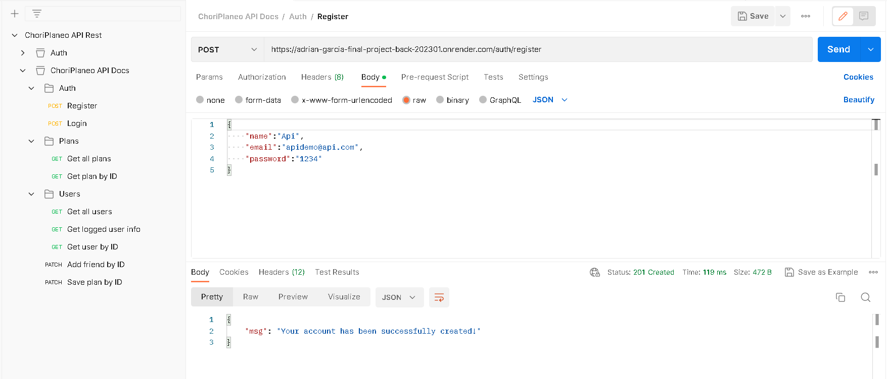
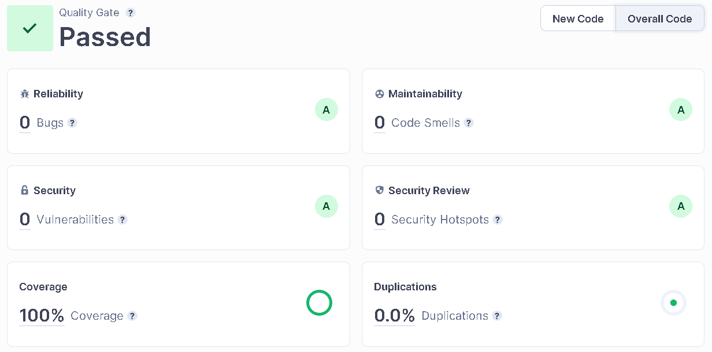

<!-- HEADING -->
<h1 align="center">
   
  
</h1>

<h3 align="center">Adrián García Final Project</h3>

Full Stack Developer Bootcamp - ISDI Coders

<!-- LINK - BADGES -->

  
  
  
  

<!-- TABLE OF CONTENTS -->

  <a href="#about">About</a> •
  <a href="#built-with">Built with</a> •
  <a href="#api-rest">API Rest</a> •
  <a href="#code-quality">Code Quality</a> •
  <a href="#demo">Demo</a> •
  <a href="#frontend">Frontend</a> •
  <a href="#license">License</a>

 

## About

### EN - ChoriPlaneo is the community application to share moments and "choriplan" new activities with your friends.

Are you looking for new adventures and exciting experiences? ChoriPlaneo is the perfect platform to share your plans and discover new trendy leisure activities.

Ready to "choriplan" with your friends? Join the ChoriPlaneo community and discover new adventures together - don't get left behind and create unforgettable moments with ChoriPlaneo!

### ES - ChoriPlaneo es la aplicación de la comunidad para compartir momentos y "choriplanear" nuevas actividades con tus amigos.

¿Estás buscando nuevas aventuras y experiencias emocionantes? ChoriPlaneo es la plataforma perfecta para compartir tus planes y descubrir nuevas actividades de ocio que están de moda.

¿Estás listo para "choriplanear" con tus amigos? Únete a la comunidad de ChoriPlaneo y descubre nuevas aventuras juntos. ¡No te quedes atrás y crea momentos inolvidables con ChoriPlaneo!

 

## Built with

> **Code**          **Production**         **Quality tools**        

 

## API Rest

For this project, a rest API has been developed with its respective endpoints, with the aim of using them to obtain information from the database from the front end.

You can see the possible API endpoints in this <a href="/ChoriPlaneo API Docs.postman_collection.json" target="_blank">link</a>. Or on the other hand, access to the collection from postman.
 

 

## Code Quality

Writing clean and scalable code is crucial to the success of any web development project. That's why I prioritize testing code using Jest to ensure it meets industry standards and best practices. I also use SonarCloud to provide real-time feedback on code quality and catch any issues early on. By prioritizing clean code and testing, we can create applications that are efficient, maintainable, and able to meet the needs of users both now and in the future.

  
  

Overall, I believe that using tools like Jest and SonarCloud to test and analyze code is critical to the success of any web development project. By prioritizing clean code and testing, we can create applications that are not only efficient but also scalable, maintainable, and able to meet the needs of users both now and in the future.

Click on the image for Sonar overview!

 

Here are the REAL TIME badges with the end result of SonarCloud scans:

 

 

 

## Demo

 

  <a href="https://adrian-garcia-final-project-front.netlify.app/" target="_blank">
    
  This project is deployed in Netlify, check it out by clicking on this link!
  </a>

  

## Frontend

This work is Full Stack, here you can access the frontend part of the project.

https://github.com/isdi-coders-2023/Adrian-Garcia-Final-Project-front-202301-mal

 

## License

This program is free software: you can redistribute it and/or modify it under the terms of the GNU General Public License as published by the Free Software Foundation, either version 3 of the License, or (at your option) any later version.

This program is distributed in the hope that it will be useful, but WITHOUT ANY WARRANTY; without even the implied warranty of MERCHANTABILITY or FITNESS FOR A PARTICULAR PURPOSE. See the GNU General Public License for more details.

<a href="/LICENSE">GPL License</a> - ChoriPlaneo Copyright © 2023 - <a href="https://github.com/Alphenx">Adrián García Iglesias</a>

